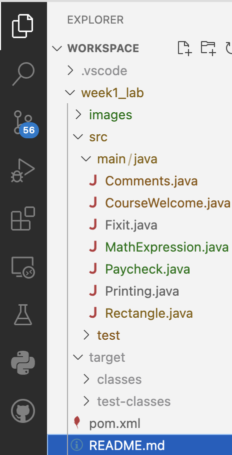
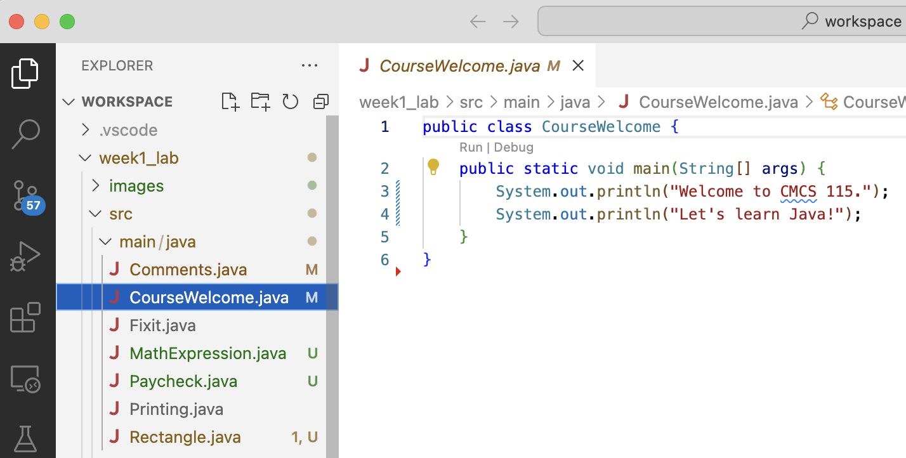
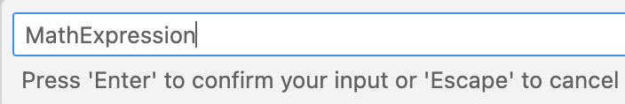
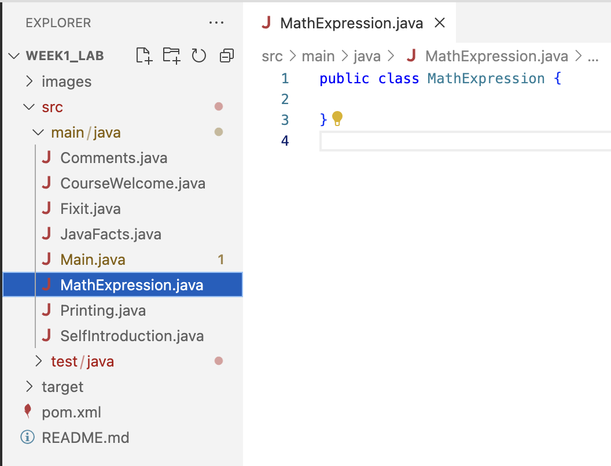

# CMSC 115 Week 1 Lab

## Learning Objectives

- Run a Java application
- Run a Junit test
- Modify a Java class
- Use comments to document code
- Comment out code to prevent execution
- Apply rules of operator precedence
- Fix common syntax errors
- Create a new Java class

## Setup

VS Code is a powerful interactive development environment (IDE) whose primary
purpose is to serve as a code editor. The basic user interface includes a
explorer on the left that lists files and folders, and an editor on the right
that displays the content of opened files.


If the explorer view is not displayed, click the top button in the activity
sidebar, or select View > Explorer from the top menu bar.


Expand the `week1_lab > src > main` folders to list the Java files in the
default package:



## Task 1 - CourseWelcome.java

Click on `CourseWelcome.java` to open the file in the editor window.



A Java class with a `main` method represents an executable program. The `main`
method is automatically called when you run the program.

```java
public class CourseWelcome {
    public static void main(String[] args) {
        System.out.println("Welcome to CMCS 115.");
        System.out.println("Let's learn Java!");
    }
}
```

When the `main` method executes, the two print statements produce the following
output:

```text
 Welcome to CMSC 115
 Let's learn Java!
```

Let's execute the program and view the output. There are several ways you can
run the program.

|                                                                                               | Ways to Run a Java Program                                           |
| --------------------------------------------------------------------------------------------- | -------------------------------------------------------------------- |
|       | Click `Run` above the main method signature                          |
|                 | Right-click in the Explorer on the Java file, then select `Run Java` |
|  | Select `Run > Run Without Debugging` from the main menubar           |

The program output is displayed in the terminal window.


### Testing a Java Program

Sometimes a program has an error and fails to produce the expected output. It is
important to thoroughly test every Java class to find and fix bugs.
[Junit](https://junit.org/junit5/) is a popular Java testing framework.

Expand the `week1_lab > src > test` folder to list the Junit test files:


For each regular Java class, we use a separate Junit class to test the
functionality.

- Java class `CourseWelcome`
- Junit test class `CourseWelcomeTest`

The `CourseWelcomeTest` Junit class has a method that checks the output produced
when `CourseWelcome` is executed. Don't worry about understanding the code in
the Junit test class. We'll learn how to write Junit tests in a later lesson.

NOTE: The `\n` in the expected output is a newline character. When your code
calls `System.out.println`, the newline character is automatically appended to
the contents.

Let's practice running a Junit test. There are several different ways to run a
Junit test class.

- In the Explorer, right-click on `CourseWelcomeTest.java`, then select
  `Run Java`.
- In the Editor, click the green arrow run button displayed next to the class
  header.
- In the main menubar, select `Run > Run Without Debugging`.


Junit displays the test result in a new view at the bottom of the window. A
green checkmark indicates the test was successful.


Close any open files.

## Task 2 - JavaFacts.java

Click on `JavaFacts.java` to open the file in the editor.

```java
public class JavaFacts {

    public static void main(String[] args) {
        System.out.println("Java was initially named Oak.");
        System.out.println("Java is a language.");
    }

}
```

`JavaFacts` should produce the expected output displayed below. However, the
actual output produced by the current code differs from the expected output.

| Expected Output                                                       | Actual Output                                        |
| --------------------------------------------------------------------- | ---------------------------------------------------- |
| Java was initially named Oak.<br>Java is an object-oriented language. | Java was initially named Oak.<br>Java is a language. |

1. Run the `JavaFacts` class. Notice the actual output does not match the
   expected output.
2. Run the Junit `JavaFactsTest` class. The test fails as indicates by the red X
   next to the test method name. The difference between the expected and actual
   output is displayed and highlighted.


Let's fix `JavaFacts` to produce the expected output.

1. Edit the second statement in the `main` method to print the character string
   "Java is an object-oriented language". Save your changes by selecting
   `File > Save` from the menu bar, or type `Ctrl-S` (Windows/Linux) or
   `Command-S` (Mac).
2. Run `JavaFacts` and view the output in the terminal window.
3. Run `JavaFactsTest` and confirm your solution passes the Junit test. You
   should see a green checkmark next to the test method.

NOTE: VS Code displays a history of all test runs. The most recent successful
test run is displayed on top, but you'll also see the old failed test run below
it. You can clear the test history so you don't see older test runs by clicking
the `Clear All Results` button.


Close any open files.

## Task 3 - Comments.java

Java comments can be used to help explain the code. A comment can also prevent
one or more lines of code from executing.

- Line comment: Text following `//` is ignored.
- Block or multi-line comment: Text between `/*` and `*/` is ignored.

Click on `Comments.java` to open the file in the editor, then run the program to
view the output.

```java
public class Comments {

    public static void main(String[] args) {

        System.out.println("apple");

        //System.out.println("orange");

        System.out.println("pear");  //End of line comment

        /*
        System.out.println("lemon");
        System.out.println("banana");
         */

        System.out.println("watermelon");

        System.out.println("peach");
    }
}

```

| Expected Output                     | Actual Output                        |
| ----------------------------------- | ------------------------------------ |
| apple<br>pear<br>watermelon<br><br> | apple<br>pear<br>watermelon<br>peach |

- The print statements for "orange", "lemon", and "banana" are commented out and
  do not execute.
- The print statement for "pear" executes since `//` is placed _after_ the
  statement.

Notice the expected output does not include "peach". Let's fix the program to
produce the expected output:

1. Add `//` to comment out the last print statement (don't delete it!). Save the
   file.
2. Run `Comments` to view the output.
3. Run `CommentsTest` to confirm your solution passes the Junit test.

Save and close any open files.

## Task 4 - Fixit.java

Click on `Fixit.java` to open the file in the editor.

```java
public class Fixit {
   public static void main(String[] args) {
      System.out.println("ship");
      //System.out.println("airplane")
      System.out.println("tank");
   }
}
```

| Expected Output          | Actual Output        |
| ------------------------ | -------------------- |
| ship<br>airplane<br>tank | ship<br>tank<br><br> |

Run the program to view the output. The second print statement is commented out
so the program does not produce the expected output.

1. Remove the comment characters `//` from the second print statement.
2. Notice the editor window displays red warning symbol at the end of the line.
   Hover the mouse over the warning symbol to view the error message. The popup
   window shows a syntax error due to a missing semicolon.<br>
   
3. Try to run the program **without** fixing the error. A warning message
   appears indicating the build failed. Click "Continue" to execute the code
   anyway. The program crashes and an error message about the missing semicolon
   is displayed in the terminal window.

Every statement in the `main` method must end with a semicolon. Let's fix the
syntax error so the program can execute.

1. Add a semicolon to fix the syntax error. Save the file.
2. Run `Fixit` to view the output.
3. Run `FixitTest` to confirm your solution passes the Junit test.

Close any open files.

## Task 5 - Printing.java

Click on `Printing.java` to open the file in the editor.

```java
public class Printing {

    public static void main(String[] args) {
        System.out.println("red ");
        System.out.print("green ");
        System.out.println("blue ");
        System.out.print("pink ");
        System.out.println("yellow");
    }

}
```

- `System.out.println`: Appends a newline character. Subsequent output appears
  on the next line.
- `System.out.print` : Does not append a newline character. Subsequent output
  appears on the same line.

| Expected Output                        | Actual Output                              |
| -------------------------------------- | ------------------------------------------ |
| red <br>green blue <br>pink <br>yellow | red <br>green blue <br>pink yellow<br><br> |

Run the program to view the output. In the expected output, "yellow" appears on
a separate line from "pink". Let's fix the program to produce the expected
output:

1. Adjust the statement `System.out.print("pink ");` so a newline character is
   appended after printing "pink".
2. Run `Printing` to view the output.
3. Run `PrintingTest` to confirm your solution passes the Junit test.

Save and close any open files.

## Task 6 - SelfIntroduction.java

Click on `SelfIntroduction.java` to open the file in the editor.

```java
/**
 * SelfIntroduction class demonstrates at least 4 print statements.
 *
 * @author First Last
 */
public class SelfIntroduction {
    public static void main(String[] args) {
        // TODO: Add print statements

    }
}
```

The `SelfIntroduction` class contains a `main` method with an empty block for
the method body. The class also contains JavaDoc comment before the class
header. JavaDoc is used to generate documentation in HTML format from Java
source code. We'll learn more about JavaDoc in a later lesson.

1. Edit the JavaDoc comment to update the author tag with your first and last
   name.
2. Edit the `main` method to add print statements to introduce yourself. The
   program should produce at least 4 lines of output.
3. Run `SelfIntroduction` to view your output. Fix any syntax errors that may
   arise.
4. Run `SelfIntroductionTest` to confirm your solution passes the Junit test,
   which is designed to count the number of lines of output.

Save and close any open files.

## Task 7 - MathematicalExpression.java

A `String` is a sequence of characters surrounded by double quotes. An unquoted
arithmetic expression evaluates to a numeric value.

| Expression      |                               Value |
| --------------- | ----------------------------------: |
| "2 + 3 \* 8 = " | &nbsp; &nbsp; &nbsp;"2 + 3 \* 8 = " |
| 2 + 3 \* 8 =    |                                  26 |

In this task, you will create a new Java class named `MathExpression`, along
with a new Junit test class named `MathExpressionTest`.

1. In the Explorer, right-click on the "java" folder in
   `week1_lab/src/main/java` and then select `New Java File > Class` from the
   popup menu. IMPORTANT: Make sure you right clicked on the word "java" and not
   "main", otherwise the new class will be created in the wrong folder.
   
2. Enter the class name `MathExpression`. Spelling and case matter.

   

3. The editor view will contain the new Java class. You should also see
   `MathExpression.java` in the Explorer at the **same level of indentation** as
   the other Java files. If not, right click to delete it and create it again,
   or try dragging the file it into the `week1_lab/src/main/java` folder.

   

4. Edit the code to add a `main` method as shown below. Notice the first
   statement prints a quoted string, while the second statement prints the value
   of a math expression.

```java
public class MathExpression {
    public static void main(String[] args) {
        System.out.print("2 + 3 * 8 = ");
        System.out.println(2 + 3 * 8);
    }
}
```

Run the program and confirm the output as shown below:

```text
2 + 3 * 8 = 26
```

Assume we would like to evolve the program to produce the expected output shown
below:

| Expected Output   | Actual Output   |
| ----------------- | --------------- |
| (2 + 3) \* 8 = 40 | 2 + 3 \* 8 = 26 |

1. Adjust the 2 print statements to produce the expected output, adding
   parenthesis to both the string and the math expression to force `+` to be
   performed before `*`.
2. Run `MathExpression` to view the output.

Let's also create a Junit class named `MathExpressionTest` to ensure
`MathExpression` produces the correct output.

1. In the Explorer, right-click on the "java" folder in
   `week1_lab/src/test/java` and then select `New Java File > Class` from the
   popup menu. Enter the class name `MathExpressionTest`.
   
2. You should see `MathExpressionTest.java` in `test/java` subfolder along with
   the other Junit test classes. You can drag the file to this folder if you
   accidentally created it in another folder.
   

3. Edit `MathExpressionTest` as shown below. The class has one test method named
   `mainOutputTest`. The test executes the `main` method in `MathExpression` and
   checks if the expected output and actual output match. Don't worry about
   understanding all of the test code. We'll learn more about Junit tests in a
   later lesson.

```java
import org.junit.jupiter.api.*;
import static org.junit.jupiter.api.Assertions.*;
import static com.github.stefanbirkner.systemlambda.SystemLambda.*;

class MathExpressionTest {

    @Test
    @DisplayName("MathExpression.main prints correct output")
    void mainOutputTest() throws Exception {
      // Define the expected output
        String expectedOutput = "(2 + 3) * 8 = 40\n";

        // Capture the actual output from MathExpression.main
        String actualOutput = tapSystemOutNormalized(() -> {
            MathExpression.main(new String[] {});
        });

        // Compare expected vs actual output
        assertEquals(expectedOutput, actualOutput);
    }

}
```

Run `MathExpressionTest` to confirm your solution passes the Junit test.

Save and close any open files.

## Submit Your Solution

If there are any open files in the editor window, right-click on one of the tabs
and select "Close All". You will be prompted if there are unsaved changes.
**Save your changes before submitting.**

TODO: Instructions on submitting
