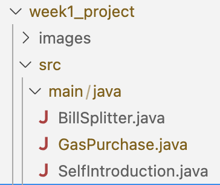

# CMSC 115 Week 1 Programming Projects

## Setup

Expand the `week1_project/src/main` folder to list the Java classes.



## Task 1 - SelfIntroduction.java

Click on `SelfIntroduction.java` to open the file in the editor.

```java
/**
 * SelfIntroduction class demonstrates at least 4 print statements.
 *
 * @author First Last
 */
public class SelfIntroduction {
    public static void main(String[] args) {
        // TODO: Add print statements to introduce yourself

    }
}
```

The `SelfIntroduction` class contains a `main` method with an empty block for
the method body. The class also contains a JavaDoc comment before the class
header.

1. Edit the JavaDoc comment to update the author tag with your first and last
   name.
2. Edit the `main` method to add print statements to introduce yourself. The
   program should produce **at least 4** lines of output.
3. Run `SelfIntroduction` to confirm your program prints at least 4 lines of
   output.

For example:

```text
My name is Spongebob.
I am majoring in Comedic Arts.
I live in a pineapple at the bottom of the sea.
I love to laugh!
```

Save and close the file.

## Task 2 - BillSplitter.java

Click on `BillSplitter.java` to open the file in the editor.

```java
/**
 * BillSplitter class demonstrates printing a math expression and order of
 * operations.
 *
 * @author First Last
 */
public class BillSplitter {
    public static void main(String[] args) {
        System.out.print("Each person owes: ");
        System.out.println("94.20 + 94.20 * 0.2 / 2"); // TODO: Fix the errors
    }
}
```

Assume 2 people are splitting a restaurant bill for $94.20 plus a 20% tip. The
program should calculate and print each person's share of the bill using the
formula shown below.


Run the program to view the output. The second print statement has a couple of
errors that prevent the program from producing the expected output.

| Expected Output         | Actual Output                              |
| ----------------------- | ------------------------------------------ |
| Each person owes: 56.52 | Each person owes: 94.20 + 94.20 \* 0.2 / 2 |

1. Edit the JavaDoc comment to update the author tag with your first and last
   name.
2. Edit the second print statement to fix the errors. The math expression should
   be corrected and its value printed.
3. Run `BillSplitter` to confirm the expected output.

HINT: Recall operator precedence and the default order of operations:

1. Parentheses
2. Multiplication and Division
3. Addition and Subtraction

Save and close the file.

## Task 3

Click on `GasPurchase.java` to open the file in the editor.

```java
import java.util.Scanner;

/**
 * GasPurchase class - demonstrate initializing variables from console input
 *
 * @author First Last
 */
public class GasPurchase {
    public static void main(String[] args) {
        Scanner input = new Scanner(System.in);

        // TODO:

    }
}
```

1. Edit the JavaDoc comment to update the author tag with your first and last
   name.
2. Edit the `main` method to prompt the user to enter the number of gallons and
   the price per gallon of gas. Declare appropriate variables to store the user
   input, then calculate and print the cost as shown in the sample runs below.
3. Run `GasPurchase` several times and confirm the expected output given the
   input values as shown in the sample runs.

| Sample Run#1                                                            | Sample Run#2                                                         |
| ----------------------------------------------------------------------- | -------------------------------------------------------------------- |
| Enter gallons and price per gallon: <b>12.5 3.50</b><br> You owe $43.75 | Enter gallons and price per gallon: <b>8.0 3.75</b><br>You owe $30.0 |

Save and close your file.

## Submit Your Solution

**Save your changes before submitting.**

If there are any open files in the editor window, right-click on one of the tabs
and select "Close All". You will be prompted if there are unsaved changes.

TODO: Instructions on submitting

<style>
   th,td {
      border: 1px solid black;
      padding: 5px;
   }
</style>
