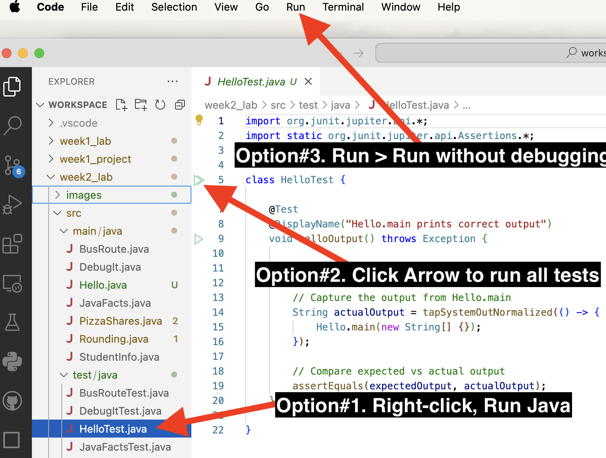
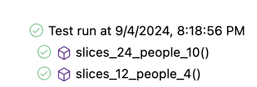
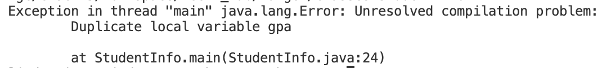

# CMSC 115 Week 2 Lab

## Learning Objectives

- Use Junit to test a class
- Use augmented assignment operators.
- Perform numeric conversion.
- Fix a program that contains syntax errors.
- Use the debugger to identify and fix logic errors.

## Setup

TODO: Instructions on how to configure debugger to prevent stepping into java.\*
methods, etc.

### Task 1 - Hello.java

Expand the `week2/src/main/java` folder to view the Java files for the week2
lab.

Click on `Hello.java` to open the file in the editor.

```java
public class Hello {
    public static void main(String[] args) {
        System.out.println("Hello World!");
    }
}
```

Sometimes a program has an error and fails to produce the expected output. It is
important to thoroughly test every Java class to find and fix bugs.

[Junit](https://junit.org/junit5/) is a popular Java testing framework. For each
regular Java class, we use a separate Junit class to test the functionality.

- Java class `Hello`
- Junit test class `HelloTest`

Expand the `week2_lab/src/test/java` folders to list the Junit test files:


The `HelloTest` Junit class has a method that checks the output produced when
the `Hello` class is executed. Don't worry about understanding the code in the
Junit test class. We'll learn how to write Junit tests in a later lesson.

```java
import org.junit.jupiter.api.*;
import static org.junit.jupiter.api.Assertions.*;
import static com.github.stefanbirkner.systemlambda.SystemLambda.*;

class HelloTest {

    @Test
    @DisplayName("Hello.main prints correct output")
    void helloOutput() throws Exception {

        String expectedOutput = "Hello World!\n";

        // Capture the output from Hello.main
        String actualOutput = tapSystemOutNormalized(() -> {
            Hello.main(new String[] {});
        });

        // Compare expected vs actual output
        assertEquals(expectedOutput, actualOutput);
    }

}
```

NOTE: The `\n` in the expected output is a newline character. When your code
calls `System.out.println`, the newline character is automatically appended to
the contents.

Let's practice running a Junit test. There are several different ways to run a
Junit test class.

- Option 1: In the Explorer, right-click on `HelloTest.java`, then select
  `Run Java`.
- Option 2: In the Editor, click the green arrow run button displayed next to
  the class header.
- Option 3: In the main menubar, select `Run > Run Without Debugging`.



Junit displays the test result in a new view at the bottom of the window. A
green checkmark indicates the test was successful. If you don't see the test run
view, click the "TEST RESULTS" tab.


Congratulations, you just ran your first successful Junit test!

Close any open files.

## Task 2 - JavaFacts.java

Click on `JavaFacts.java` to open the file in the editor.

```java
public class JavaFacts {

	public static void main(String[] args) {
		System.out.println("Java was initially named Oak.");
		System.out.println("Java is a language.");
	}

}
```

`JavaFacts` should produce the expected output displayed below. However, the
actual output produced by the current code differs from the expected output.

| Expected Output                                                       | Actual Output                                        |
| --------------------------------------------------------------------- | ---------------------------------------------------- |
| Java was initially named Oak.<br>Java is an object-oriented language. | Java was initially named Oak.<br>Java is a language. |

1. Run the `JavaFacts` class. Notice the actual output does not match the
   expected output.
2. Run the `JavaFactsTest` Junit class. The test fails as indicated by the red X
   next to the test run, along with the error messages displayed in the "TEST
   RESULTS" window (scroll through the error messages). A popup window shows the
   difference between the expected and actual output.


Let's fix `JavaFacts` to produce the expected output.

1. Edit the second statement in the `main` method to print the character string
   "Java is an object-oriented language". Save your changes.
2. Run `JavaFacts` and view the output in the terminal window.
3. Run `JavaFactsTest` and confirm your solution passes the Junit test. You
   should see a green checkmark next to the test method.

   

NOTE: VS Code displays a history of all test runs. The most recent successful
test run is displayed on top, but you'll also see the old failed test run below
it. You can clear the test history so you don't see older test runs by clicking
the `Clear All Results` button.


Close any open files.

## Task 3 - PizzaShares.java

Click on `PizzaShares.java` to open the file in the editor.

```java
import java.util.Scanner;

/**
 * PizzaShares class demonstrates user input, along with division and remainder operators
 * @author First Last
 */
public class PizzaShares {

	public static void main(String[] args) {
		//Declare local variables
		int people, totalSlices, slicesPerPerson, slicesRemaining;

		//Declare and initialize Scanner to read user input
		Scanner input = new Scanner(System.in);

		//Prompt for number of pizza slices and number of people
		System.out.print("Enter #slices and #people: ");
		totalSlices = input.nextInt();
		people = input.nextInt();

		//Compute number of slices per person
		slicesPerPerson = totalSlices / people;

		System.out.println("Each person gets " + slicesPerPerson + " slices.");

		//TODO: Compute and print number of slices remaining

	}

}
```

The program uses a `Scanner` to read user input and initialize the `totalSlices`
and `people` variables. The `slicesPerPerson` variable stores the number of
whole slices per person.

Run `PizzaShares`, entering the sample input displayed in bold:

<table>
<tr>
<th>Sample Run</th>
</tr>
<tr>
<td>Enter #slices and #people: <b>24 10</b><br>
Each person gets 2 slices.</td>
</tr>
</table>

Given 24 slices and 10 people, each person gets 2 slices. How many slices are
leftover?

<table>
<tr><td>Operator</td><td>Meaning</td><td>Expression</td><td>Value</td></tr>
<tr><td>+</td><td>addition</td><td>5+3</td><td>8</td></tr>
<tr><td>-</td><td>subtraction</td><td>8-2</td><td>6</td></tr>
<tr><td>*</td><td>multiplication</td><td>4*5</td><td>20</td> </tr>
<tr><td>/</td><td>division</td><td>17/3</td><td>5</td> </tr>
<tr><td>%</td><td>remainder</td><td>17%3</td><td>2</td> </tr>
</table>

 </tr>
</table>

1. Update the program to use Java's modulo (remainder) operator to calculate and
   print the leftover slices as shown in the sample runs below.
2. Run `PizzaShares` several times, passing different input values and
confirming the expected output.
<table>
<tr>
<th>Sample Run#1</th><th>Sample Run#2</th>
</tr>
<tr>
<td>Enter #slices and #people: <b>24 10</b><br>
Each person gets 2 slices.<br>
There are 4 slices remaining.</td>
<td>Enter #slices and #people: <b>12 4</b><br>
Each person gets 3 slices.<br>
There are 0 slices remaining.</td>
</tr>
</table>

3. Run `PizzaSharesTest` to confirm your solution passes the Junit tests. Note
   there are two test methods, each checking a different set of inputs. You'll
   should see multiple test results displayed.



## Task 4 - StudentInfo.java

Double click on `StudentInfo.java` in the Package Explorer to open the file in
the editor, then run the program to view the output.

```java
/**
 * StudentIfno class demonstrates an error in redeclaring a variable.
 * @author First Last
 */
public class StudentInfo {

	public static void main(String[] args) {
		//Variable declaration and initialization
		double gpa = 3.8;

		//Variable declaration
		int age;
		//Variable initialization
		age = 28;

		//Print initial values
		System.out.println("Age: " + age + " gpa: " + gpa);

		//Update age to 29
		age = 29;

		//TODO: Fix the error and update gpa to 4.0.
		//double gpa = 4.0;

		//Print updated values
		System.out.println("Age: " + age + " gpa: " + gpa);

	}

}
```

<table>
<tr>
<th>Expected Output</th>
<th>Actual Output</th>
</tr>
<tr>
<td>Age: 28 gpa: 3.8<br>
Age: 29 gpa: 4.0</td>
<td>Age: 28 gpa: 3.8<br>
Age: 29 gpa: 3.8</td>
</tr>
</table>

After updating `age` to 29, the code should update `gpa` to 4.0. The line to
reassign `gpa` to 4.0 is currently commented out.

<table>

<tr>
<td>

</td>
<td>
Remove the comment character on line 23. 
</td>
</tr>

<tr>
<td>

</td>
<td>
The variable <code>gpa</code> is underlined in red to indicate an error. Hover the mouse over the error.

A message "Duplicate local variable gpa" is displayed.

The variable `gpa` was previously declared on line 9.

</td>
</tr>

<tr>
<td>

</td>
<td>
Try to run the program.

It crashes due to the duplicate variable declaration.

</td>
</tr>

</table>

Let's fix the error.

Line 23 should assign `gpa` to 4.0 **without** redeclaring the variable.

1. Remove the type `double` on line 23 to prevent a duplicate variable
   declaration. The compiler error should go away.
2. Run `StudentInfo` to view the output.
3. Run `StudentInfoTest` to confirm your solution passes the Junit test.

Save and close any open files.

## Task 5 - BusRoute.java

Java has increment and decrement operators:

<table>
<tr><td>Operator</td><td>Expression</td><td>Equivalent</td></tr>
<tr><td>++</td><td>x++</td><td>x = x + 1</td></tr>
<tr><td>--</td><td>x--</td><td>x = x - 1</td></tr>
</table>

Java also supports augmented assignment operators:

<table>
<tr><td>Operator</td><td>Expression</td><td>Equivalent</td></tr>
<tr><td>+=</td><td>x += 5</td><td>x = x + 5</td></tr>
<tr><td>-=</td><td>x -= 5</td><td>x = x - 5</td></tr>
<tr><td>*=</td><td>x *= 5</td><td>x = x * 5</td> </tr>
<tr><td>/=</td><td>x /= 5</td><td>x = x / 5</td> </tr>
<tr><td>%=</td><td>x %= 5</td><td>x = x % 5</td> </tr>
</table>

Click on `BusRoute.java` to open the file in the editor, then run the program to
view the output.

```java
/**
 * BusRoute class demonstrates augmented assignment operators and increment operator.
 * @author First Last
 */
public class BusRoute {

	public static void main(String[] args) {
		int passengers = 0;
		int busStop = 0;
		System.out.println("Bus begins its route");

		//first stop, 8 people get on (addition assignment operator)
		busStop++;
		System.out.println("8 passengers get on at stop#" + busStop);
		passengers += 8;
		System.out.println("Departing stop#" + busStop + " with " + passengers + " passengers");

		//next stop, 2 get off (subtraction assignment operator)
		busStop++;
		System.out.println("2 passengers get off at stop#" + busStop);
		passengers -= 2;
		System.out.println("Departing stop#" + busStop + " with " + passengers + " passengers");

		//TODO: next stop, half the passengers get off (use division assignment operator)

		//TODO: next stop, the number of passengers triples (use multiplication assignment operator)

	}
}
```

The program uses the increment operator `++` along with augmented assignment
operators `+=` and `-=` to update `busStop` and `passengers`.

| Expected Output                                                                                                                                                                                                                                                                                                                        | Actual Output                                                                                                                                                                               |
| -------------------------------------------------------------------------------------------------------------------------------------------------------------------------------------------------------------------------------------------------------------------------------------------------------------------------------------- | ------------------------------------------------------------------------------------------------------------------------------------------------------------------------------------------- |
| Bus begins its route<br>8 passengers get on at stop#1<br>Departing stop#1 with 8 passengers<br>2 passengers get off at stop#2<br>Departing stop#2 with 6 passengers<br>Half the passengers get off at stop#3<br>Departing stop#3 with 3 passengers<br>The number of passengers triples at stop#4<br>Departing stop#4 with 9 passengers | Bus begins its route<br>8 passengers get on at stop#1<br>Departing stop#1 with 8 passengers<br>2 passengers get off at stop#2<br>Departing stop#2 with 6 passengers<br> <br> <br> <br> <br> |

1. Update `BusRoute.java` to add two more bus stops. Use the appropriate
   augmented assignment operators to adjust the passenger count.
   - Half the passengers get off at the 3rd stop.
   - The number of passengers triples at the 4th stop.
2. Run `BusRoute` to view the output.
3. Run `BusRouteTest` to confirm your solution passes the Junit tests. Aside
   from checking the output, there are tests that check for the presence of the
   division assignment and multiplication assignment operators.

## Task 6 - DebugIt.java

Click on `DebugIt.java` to open the file in the editor, then run the program to
view the output.

- Line 12 should increase `planesOnRunway` by 5.
- Line 14 should decrease `planesOnRunway` by 3.

```java
/**
 * DebugIt class demonstrates common operator errors.
 * @author First Last
 */
public class DebugIt {

	//TODO: Fix the operator errors
	public static void main(String[] args) {
		int planesOnRunway = 2;

		//5 planes land on runway, increase planesOnRunway by 5
		planesOnRunway =+ 5;   //expected value: 7
		//3 planes take off, decrease planesOnRunway by 3
		planesOnRunway =- 3;   //expected value: 4

		System.out.println("Planes on runway = " + planesOnRunway);
	}

}
```

The program has a subtle but common error that prevents it from producing the
expected output:

| Expected Output      | Actual Output         |
| -------------------- | --------------------- |
| Planes on runway = 4 | Planes on runway = -3 |

Let's use the debugger to execute each line and view the variables in memory.

<table>

<tr>
<td>

</td>
<td>
Set a breakpoint at line 9.

Start the debugger.

</td>
</tr>

<tr>
<td>

</td>
<td>
The main method is called and stops execution at the breakpoint. 
</td>
</tr>
</table>

We'll find the bug using the "step over" button to execute one line of code at a
time and view the variable in memory.

<table>

<tr>
<th>
Step Over
</th>
<th>
Current line
</th>
<th>
Variables View
</th>
</tr>

<tr>
<td>

</td>
<td>
<code>int planesOnRunway = 2;</code>
</td>
<td>

</td>
</tr>

<tr>
<td>
</td>
<td>
<code>planesOnRunway =+ 5;</code></td>
<td>

<br>
<br>
The variable should be increased by 5, resulting in the value 7, but it is assigned to 5.
<br><br>
The statement has a logic error.
</td>
</tr>

<tr>
<td>
</td>
<td>
<code>planesOnRunway =- 3;</code></td>
<td>

<br>
<br>
The variable should be decreased by 3, resulting in the value 4, but it is assigned to -3.
<br><br>
The statement has a logic error.
</td>
</tr>

<tr>
<td>
</td>
<td>
<code>System.out.println("Planes on runway = " + planesOnRunway);</code></td>
<td>

<br>
The actual output does not match the expected output.
</td>
</tr>

<tr>
<td>

</td>
<td colspan="2">
We've reached the end of the main method.  Press the red square to terminate the debug session.
</td>
</tr>

</table>

This example demonstrates a common error with augmented assignment operators.

<table>

<tr>
<th>
Current Incorrect Code
</th>
<th>
Equivalent Code
</th>
</tr>

<tr>
<td>
<code>planesOnRunway =+ 5;</code>
</td>
<td>
<code>planesOnRunway = +5;</code>
<br><br>Assign to positive 5.
</td>
</tr>

<tr>
<td>
<code>planesOnRunway =- 3;</code>
</td>
<td>
<code>planesOnRunway = -3;</code>
<br><br>Assign to negative 3.
</td>
</tr>

</table>

Augmented assignment operators requires the math operator to come **before** the
equal sign, not after it!

<table>
<tr><td>Operator</td><td>Expression</td><td>Equivalent</td></tr>
<tr><td>+=</td><td>x += 5</td><td>x = x + 5</td></tr>
<tr><td>-=</td><td>x -= 5</td><td>x = x - 5</td></tr>
<tr><td>*=</td><td>x *= 5</td><td>x = x * 5</td> </tr>
<tr><td>/=</td><td>x /= 5</td><td>x = x / 5</td> </tr>
<tr><td>%=</td><td>x %/ 5</td><td>x = x % 5</td> </tr>
</table>

1. Fix `DebugIt.java` to use the correct augmented assignment operators to
   update `planesOnRunway`.
2. Run `DebugIt` to confirm the expected output.
3. Run `DebugItTest` to confirm the Junit tests pass.

Try to remember this error, it is a very common mistake!

## Task 7 - Rounding.java

Click on `Rounding.java` to open the file in the editor.

```java
import java.util.Scanner;

/**
 * Rounding class demonstrates numeric conversion and rounding.
 * (1) Cast a double to an int
 * (2) Round a double to nearest integer
 * (3) Truncate a double to 3 digits after the decimal point
 * (4) TODO: Round a double to 3 digits after the decimal point
 * @author First Last
 */

public class Rounding {

	public static void main(String[] args) {
		Scanner input = new Scanner(System.in);

		System.out.print("Enter number: " );
		double num = input.nextDouble();

		System.out.println("Cast as int: " + (int)num);
		System.out.println();

		System.out.println("Round to nearest int");
		System.out.println("Original: \t"  	+ num);
		System.out.println("Add 0.5:\t" 	+ (num + 0.5));
		System.out.println("Cast as int:\t" + (int) (num + 0.5));
		System.out.println();

		System.out.println("Truncate to 3 digits after the decimal point");
		System.out.println("Original:\t\t"      		+ num);
		System.out.println("Move . 3 digits right:\t" 	+ num * 1000 );
		System.out.println("Cast as int\t\t"        	+ (int) (num * 1000));
		System.out.println("Move . 3 digits left:\t"  	+ (int) (num * 1000 ) / 1000.0);
		System.out.println();

		//TODO
		System.out.println("Round to 3 digits after the decimal point");

	}

}
```

Run the program, passing the bold value as input:

<table>
<tr>
<th>Sample Run#1</th>
<th>Sample Run#2</th>
</tr>
<tr>
<td>Enter number: <b>1.9247</b><br>
Cast as int: 1<br>
<br>
Round to nearest int<br>
Original: 	1.9247<br>
Add 0.5:	2.4247<br>
Cast as int:	2<br>
<br>
Truncate to 3 digits after the decimal point<br>
Original:		1.9247<br>
Move . 3 digits right:	1924.7<br>
Cast as int		1924<br>
Move . 3 digits left:	1.924<br>
<br>
Round to 3 digits after the decimal point
</td>
<td>Enter number: <b>3.2984</b><br>
Cast as int: 3<br>
<br>
Round to nearest int<br>
Original: 	3.2984<br>
Add 0.5:	3.7984<br>
Cast as int:	3<br>
<br>
Truncate to 3 digits after the decimal point<br>
Original:		3.2984<br>
Move . 3 digits right:	3298.4<br>
Cast as int		3298<br>
Move . 3 digits left:	3.298<br>
<br>
Round to 3 digits after the decimal point

</tr>
</table>

Casting converts a value in one data type to another:

<table>

<tr>
<th>
Expression
</th>
<th>
Value
</th>
</tr>

<tr>
<td>
(int)5.274
</td>
<td>
5
</td>
</tr>

<tr>
<td>
(double)3
</td>
<td>
3.0
</td>
</tr>

</table>

We can round a double to the nearest integer by adding 0.5 and then casting the
result as an int. If the fractional part is less than 0.5, the number rounds
down otherwise it rounds up:

<table>

<tr>
<th>
Expression
</th>
<th>
Value
</th>
</tr>

<tr>
<td>
(int)(7.3 + 0.5)
</td>
<td>
7
</td>
</tr>

<tr>
<td>
(int)(7.6 + 0.5)
</td>
<td>
8
</td>
</tr>

</table>

We can truncate a number to N digits after the decimal point using the following
expression

<table>

<tr>
<th>
Expression
</th>
<th>
Truncate digits
</th>
</tr>

<tr>
<td>
(int) (num * 10 ) / 10.0);
</td>
<td>
1 digit after decimal point
</td>
</tr>

<tr>
<td>
(int) (num * 100 ) / 100.0);
</td>
<td>
2 digits after decimal point
</td>
</tr>

<tr>
<td>
(int) (num * 1000 ) / 1000.0);
</td>
<td>
3 digits after decimal point
</td>
</tr>

</table>

The `Rounding` class shows how to:

1. cast a double as an int
2. round a double to the nearest integer
3. truncate a double to 3 digits after the decimal point.

Your task is to update the `main` method with statements to round the input
value to 3 digits after the decimal point.

1. Update `Rounding.java` to round the number to 3 digits after the decimal
   point, producing the expected output displayed in the sample runs.
2. Run `Rounding` to confirm the output.
3. Run `RoundingTest` to confirm your solution passes the Junit tests.

<table>
<tr>
<th>Sample Run#1</th>
<th>Sample Run#2</th>
</tr>
<tr>
<td>Enter number: <b>1.9247</b><br>
Cast as int: 1<br>
<br>
Round to nearest int<br>
Original: 	1.9247<br>
Add 0.5:	2.4247<br>
Cast as int:	2<br>
<br>
Truncate to 3 digits after the decimal point<br>
Original:		1.9247<br>
Move . 3 digits right:	1924.7<br>
Cast as int		1924<br>
Move . 3 digits left:	1.924<br>
<br>
Round to 3 digits after the decimal point<br>
Original:		1.9247<br>
Move . 3 digits right:	1924.7<br>
Add 0.5:		1925.2<br>
Cast as int		1925<br>
Move . 3 digits left:	1.925<br>
</td>

<td>Enter number: <b>3.2984</b><br>
Cast as int: 3<br>
<br>
Round to nearest int<br>
Original: 	3.2984<br>
Add 0.5:	3.7984<br>
Cast as int:	3<br>
<br>
Truncate to 3 digits after the decimal point<br>
Original:		3.2984<br>
Move . 3 digits right:	3298.4<br>
Cast as int		3298<br>
Move . 3 digits left:	3.298<br>
<br>
Round to 3 digits after the decimal point<br>
Original:		3.2984<br>
Move . 3 digits right:	3298.4<br>
Add 0.5:		3298.9<br>
Cast as int		3298<br>
Move . 3 digits left:	3.298<br>
</tr>
</table>

## Task 8

TODO: Create new Java class. Create new Junit class.

## Submit Your Solution

Save and close any open files.

TODO: Instructions on submitting

<style>
table, th, td {
  border: 1px solid black;
  padding: 4px;
  border-collapse: collapse;
  
  }
</style>
