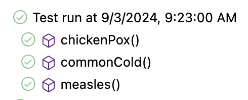

# CMSC 115 Week 2 Programming Projects

## Setup

TODO: ...

NOTE: You may need to click on the "TEST RESULTS" tab to see the Junit test run
result.

## Task 1 - TransmissionRate.java

Click on `TransmissionRate.java` to open the file in the editor.

R0 (pronounced R-naught) is a number that refers to the transmission
rate of a given virus. If R0 is 5, then 1 person is capable of
spreading to 5 other persons on average.

The table below shows the number of new cases after various iterations of viral
spread:

<table>
<tr>
<th>R0</th>
<th>Iteration 1</th>
<th>Iteration 2</th>
<th>Iteration 3</th>
<th>Iteration 4</th>
</tr>

<tr>
<td>Common Cold: 2</td>
<td>2</td>
<td>4</td>
<td>8</td>
<td>16</td>
</tr>

<tr>
<td>1918 Flu: 3</td>
<td>3</td>
<td>9</td>
<td>27</td>
<td>81</td>
</tr>

<tr>
<td>Chickpox: 10</td>
<td>10</td>
<td>100</td>
<td>1000</td>
<td>10000</td>
</tr>

</table>

Update the `main` method to implement the following functionality:

1. Declare and initialize a `Scanner` to read input from the console.
2. Prompt for and read the transmission rate R0 as an integer.
3. Call `Math.pow` to calculate the potential new cases at the 4th iteration
   based on the given R0 value.
4. Use casting to convert the `double` value returned from `Math.pow` to an
   `int`.
5. Print the number of new cases as shown in the sample runs.

<table>
<tr>
<th>Sample Run#1</th>
<th>Sample Run#2</th>
</tr>
<tr>
<td>Enter r0: <b>2</b> 
New cases on 4th iteration: 16
</td>
<td>Enter r0: <b>18</b> 
New cases on 4th iteration: 104976
</td>

</tr>
</table>

Run `TransmissionRateTest` to confirm your solution passes the Junit tests.

NOTE: You may need to click on the "TEST RESULTS" tab to see the Junit test run
result.

Save and close any open files.

## Task 2 - SeafoodMarket.java

Click on `SeafoodMarket.java` to open the file in the editor.

Update the `main` method to implement the following functionality:

1. Declare and initialize a `Scanner` to read input from the console.
2. Prompt for and read two doubles: (1) pounds of fish and (2) price per pound.
3. Calculate the total cost as a double, rounding the value to 2 digits after
   the decimal point.
4. Print the pounds, price per pound, and total cost as shown in the sample runs
   below.

<table>
<tr>
<th>Sample Run#1</th>
<th>Sample Run#2</th>
</tr>
<tr>
<td>Enter pounds of fish and price per pound: <b>5 8.99</b> 
5.0 lbs at $8.99 per lb = $44.95
</td>
<td>Enter pounds of fish and price per pound: <b>3.25 15.99</b> 
3.25 lbs at $15.99 per lb = $51.97
</td>

</tr>
</table>

Run `SeafoodMarketTest` to confirm your solution passes the Junit tests.

Save and close any open files.

# Task 3 - NearestInt.java

Double click on `NearestInt.java` in the Package Explorer to open the file in
the editor.

Update the `main` method to implement the following functionality:

1. Declare and initialize a `Scanner` to read input from the console.
2. Prompt for and read two ints: (1) numerator and (2) denominator.
3. Print the numeric conversions displayed in the sample runs. Hint: subtract
   0.5 when rounding to the nearest negative int.

<table>
<tr>
<th>Sample Run#1</th>
<th>Sample Run#2</th>
</tr>
<tr>
<td>Enter numerator and denominator: <b>19 4</b> 
Fraction: 19/4 
Double Value: 4.75 
Cast as Int: 4 
Rounded to nearest int: 5 
Negative Value: -4.75 
Negative Value rounded to nearest int: -5
</td>
<td>Enter numerator and denominator: <b>11 8</b> 
Fraction: 11/8 
Double Value: 1.375 
Cast as Int: 1 
Rounded to nearest int: 1 
Negative Value: -1.375 
Negative Value rounded to nearest int: -1 
</td>

</tr>
</table>

Run `NearestIntTest` to confirm your solution passes the Junit tests.

Save and close any open files.

## Task 4 - Operators

Click on `BasketballGame.java` to open the file in the editor.

The program prompts for the home and away scores for the first quarter,
initializes variables to store each team's score, and prints the scores for the
1st quarter.

Your task is to update the code for the 2nd, 3rd, and 4th quarters based on the
instructions given in the comments.

<table>
<tr>
<th>Sample Run#1</th>
<th>Sample Run#2</th>
</tr>
<tr>
<td>Home and away points for 1st quarter: <b>25 20</b> 
1st quarter scores: home 25 away 20 
2nd quarter scores: home 50 away 50 
After challenge: home 47 away 50 
3rd quarter scores: home 57 away 62 
After challenge: home 58 away 62 
4th quarter scores: home 82 away 81
</td>
<td>
Home and away points for 1st quarter: <b>30 22</b> 
1st quarter scores: home 30 away 22 
2nd quarter scores: home 60 away 60 
After challenge: home 57 away 60 
3rd quarter scores: home 67 away 72 
After challenge: home 68 away 72 
4th quarter scores: home 97 away 96 
</td>
</tr>
</table>

Run `BasketballGameTest` to confirm your solution passes the Junit tests.

Save and close any open files.

